# Pewlett Hackard: Employee Database with SQL

## Overview of Pewlett Hackard
In this module, we have teamed up with Bobby who is an HR analyst for fictitious company Pewlett Hackard (PH). PH expects a large number of its employees to be close to retirement, and they've asked Bobby to help them prepare. For instance, they first want to know which of their retiring employees qualify for a retirement package. And second, which positions will have to be filled with new employees. To answer these questions, we were provided with six .csv files and asked to use SQL to complete the analysis. The six .csv files included:

- [employees.csv](data/employees.csv): List of every employee with their `employee ID`, `first name`, `last name`, `birth date`, `gender`, and `hire date`.
- [dept_emp.csv](data/dept_emp.csv): List of which department each employee belongs to with their `employee ID`, `department number`, and the `from-date` and `to-date` specifying when they were members of that department.
- [dept_manager.csv](data/dept_manager.csv): List of the managers of each department over time with the `employee ID`, `department number` that they are the manager of, and the `from-date` and `to-date` specifying when they were the manager for that department.
- [departments.csv](data/departments.csv): List of all of the `department names` and their corresponding `department numbers`.
- [titles.csv](data/titles.csv): List of every employee's title(s) with their `employee ID`, their `title`, and the `from-date` and `to-date` specifying when they held that title.
- [salaries.csv](data/salaries.csv): List of every employee's salary with their `employee ID`, their `salary`, and the `from-date` and `to-date` specifying when they earned that salary.

Additionaly, we used [QuickDBD](https://www.quickdatabasediagrams.com/) to create an Entity Relationship Diagram (ERD) to show how the six .csv files relate to each other. The script used to generate the diagram can be found here: [EmployeeDB_QuickDBD_Schema.txt](resources/EmployeeDB_QuickDBD_Schema.txt). The resulting ERD is shown below:

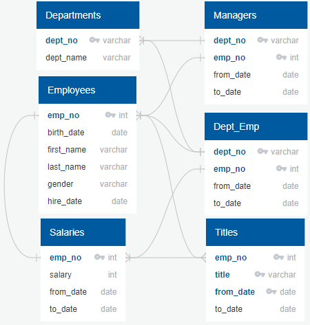

The result was a single list of every single employee eligible for retirement, which was a bit overwhelming to the HR team. In this Challenge assignment, we divide the retiring employees into groups based on their title to get a better idea of the types of employees who are retiring and need to be replaced. Additionally, we identify employees who are eligible to participate in a mentorship program for new employees. These tasks are divided into the two deliverables shown below (from the Module Challenge webpage), along with substasks for each deliverable which we will walk through further down. The text for each deliverable is taken from the starter files. Below each subtask is an image of the SQL script necessary to complete it. All SQL queries used in this Challenge can also be found in [Employee_Database_challenge.sql](queries/Employee_Database_challenge.sql).

- **Deliverable 1: The Number of Retiring Employees**. Create a `Retirement Titles` table that holds all the *most recent* titles of employees who were born between January 1, 1952 and December 31, 1955. Then, create a table that has the number of retirement-age employees by most recent job title. Finally, make sure the table only includes current employees by excluding those who have already left the company.
- **Deliverable 2: The Employees Eligible for the Mentorship Program**. Create a `Mentorship Eligibility` table that holds the current employees who were born between January 1, 1965 and December 31, 1965.

## Resources
- Software: pgAdmin4 6.15 with PostgreSQL 14, [QuickDBD](https://www.quickdatabasediagrams.com/)

## Deliverable 1: The Number of Retiring Employees

### Retirement Titles Table
1. Retrieve the `emp_no`, `first_name`, and `last_name` columns from the Employees table.
2. Retrieve the `title`, `from_date`, and `to_date` columns from the Titles table.
3. Create a new table using the `INTO` clause.
4. Join both tables on the primary key.
5. Filter the data on the `birth_date` column to retrieve the employees who were born between 1952 and 1955. Then, order by the employee number.
6. Export the Retirement Titles table from the previous step as [retirement_titles.csv](data/retirement_titles.csv).

The SQL script to generate this file is shown here:

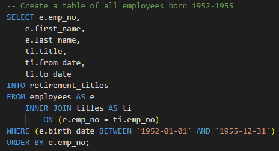

### Unique Titles Table
7. Retrieve the `employee number`, `first` and `last name`, and `title` columns from the Retirement Titles table.
8. Use the `DISTINCT ON` statement to retrieve the first occurrence of the employee number for each set of rows defined by the `ON ()` clause.
9. Exclude those employees that have already left the company by filtering on `to_date` to keep only those dates that are equal to `'9999-01-01'`.
10. Create a Unique Titles table using the `INTO` clause.
11. Sort the Unique Titles table in ascending order by the employee number and descending order by the last date (i.e., `to_date`) of the most recent title.
12. Export the Unique Titles table as [unique_titles.csv](data/unique_titles.csv).

The SQL script to generate this file is shown here:

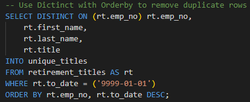

### Retiring Titles Table
13. Retrieve the number of titles from the Unique Titles table.
14. Create a Retiring Titles table to hold the required information.
15. Group the table by title, then sort the count column in descending order.
16. Export the Retiring Titles table as [retiring_titles.csv](data/retiring_titles.csv).

The SQL script to generate this file is shown here:

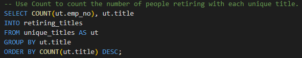

## Deliverable 2: The Employees Eligible for the Mentorship Program

1. Retrieve the `emp_no`, `first_name`, `last_name`, and `birth_date` columns from the Employees table.
2. Retrieve the `from_date` and `to_date` columns from the Department Employee table.
3. Retrieve the `title` column from the Titles table.
4. Use a `DISTINCT ON` statement to retrieve the first occurrence of the employee number for each set of rows defined by the `ON ()` clause.
5. Create a new table using the `INTO` clause.
6. Join the Employees and the Department Employee tables on the primary key.
7. Join the Employees and the Titles tables on the primary key.
8. Filter the data on the `to_date` column to all the current employees, then filter the data on the `birth_date` columns to get all the employees whose birth dates are between January 1, 1965 and December 31, 1965.
9. Order the table by the employee number.
10. Export the Mentorship Eligibility table as [mentorship_eligibility.csv](data/mentorship_eligibility.csv).

The SQL script to generate this file is shown here:

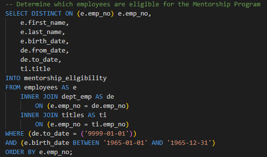

## Results

- **Retirement Titles Table**: From the [retirement_titles.csv](data/retirement_titles.csv) file, it initially appears that there are 133,776 employees eligible for retirement. However, as seen in the image below, this number is incorrect due to most employees being listed multiple times. An employee would appear multiple times if, for instance, they received a promotion and new title. To rectify this, the Unique Titles table was created to eliminate duplicates.

    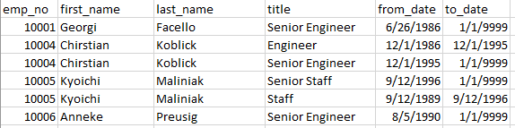

- **Unique Titles Table**: Duplicate employees were removed to create [unique_titles.csv](data/unique_titles.csv), from which we can see that there are 72,458 employees retiring. The snippet below shows that duplicates have been removed.

    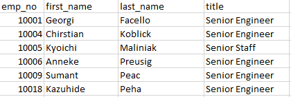

- **Retiring Titles Table**: A more useful table sorts the retiring employees by their job title to give the company an idea of the types of positions that need to be re-filled, shown in [retiring_titles.csv](data/retiring_titles.csv). Those retiring: 25,916 senior engineers; 24.926 senior staff; 9,285 engineers; 7,636 staff; 3,603 technique leaders; 1,090 assistant engineers; and 2 managers.

    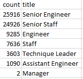

- **Employees Eligible for the Mentorship Program**: From the [mentorship_eligibility.csv](data/mentorship_eligibility.csv) file, it can be seen that there are only 1,549 eligible mentors for newer employees.

## Summary

Pewlett Hackard had two main questions, which are answered below.

1. **How many roles will need to be filled as the "silver tsunami" begins to make an impact?** Pewlett Hackard stands to lose 72,458 of its 300,024 employees (nearly a quarter!) to the silver tsunami retirement phenomenon. A company as large as PH probably has some redundancies in roles. As such, this represents an opportunity to streamline and make things more efficient. Thus, PH probably does not need to hire 72,458 employees in a one-to-one replacement. However, they will need to hire several tens of thousands of new employees. The positions seeing the largest numbers of retirement are at the Senior Staff and Senior Engineer levels. These positions can be filled by promoting from within PH. Then, new people can be hired at the lower Assistant Staff and Assistant Engineer levels.

2. **Are there enough qualified, retirement-ready employees in the departments to mentor the next generation of Pewlett Hackard employees?** There are only 1,549 eligible mentors for new employees. Assuming PH hires 72,458 new employees (despite my assertion above), then each mentor would need to take roughly 47 mentees under their wing. Most mentors can handle one or two mentees at most, so this is completely infeasible. To ensure newer employees receive the mentorship they need, PH would need to dramatically expand the eligibility criteria for mentors.

Two additional queries or tables that may provide more insight are described below.

1. **Create a table of all eligible mentors broken down by title.** We calculated the ratio of mentees/mentors above, but that was company-wide. Certain titles may need more help for mentors than others. The SQL script to separate the mentors by title as well as a diagram showing how many mentors there are for each title are shown below (assuming for instance that a Senior Engineer would mentor an Engineer, etc). Based on this, there are 13 Staff mentees per available Senior Staff mentor; 2 Assistant Engineer mentees per available Engineer mentor; and 55 Engineer mentees per available Senior Engineer mentor. Based on these results, there are plenty of Engineers to mentor Assistant Engineers. However, Senior Engineers are going to struggle to mentor all of the Engineers that need it.

    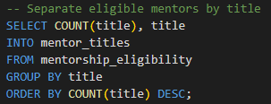

    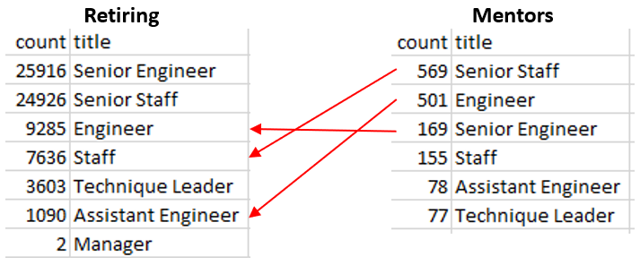

2. **Expand the eligibility criteria so that more employees may participate as mentors.** Expanding the mentorship eligibility window by ±2 years (covering the years 1963 - 1967) increases the number of eligible mentors from 1,549 to 38,401. This expanded eligibility would bring the ratio of mentees/mentors down to roughly 2:1, which is a much more reasonable number.

    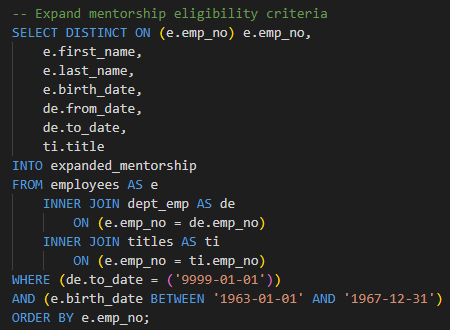